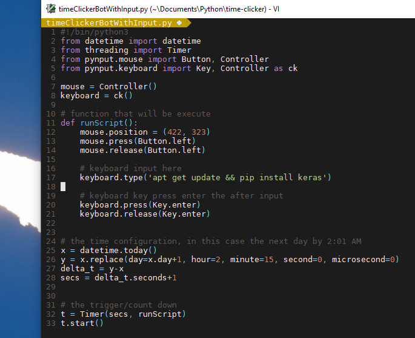

# time-clicker

Bot to click something at a specific time. It's quite useful for some tasks such as:
- executing a command at a specific time
- download a program at a specific time
- etc.

## Preview

## Built With

* [Python3](https://github.com/python/cpython)
* [PyInput](https://github.com/moses-palmer/pynput)

## Support

If you like what you see, feel free to buy me a coffee.

